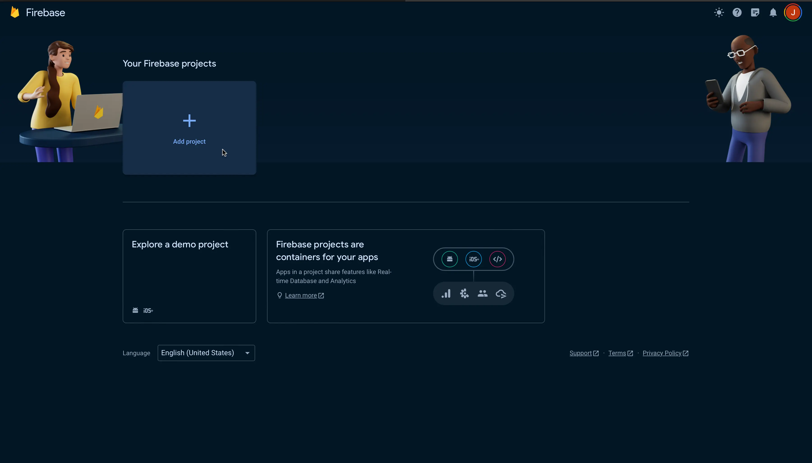
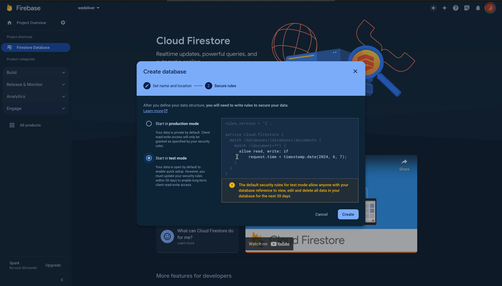
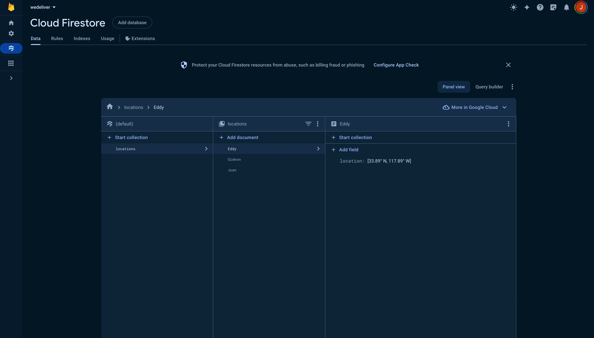
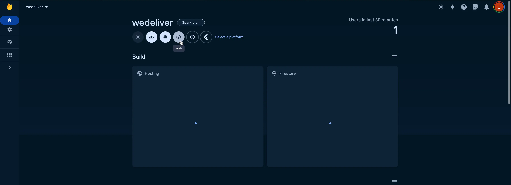
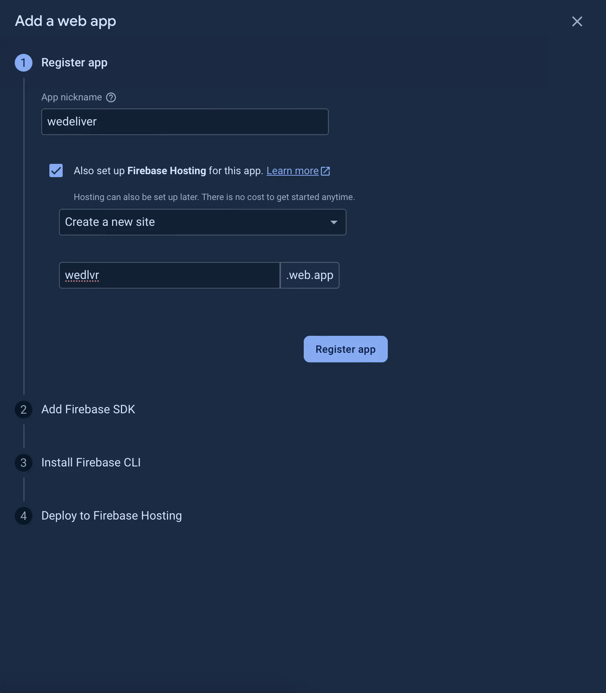
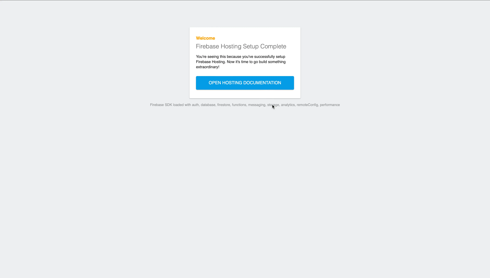
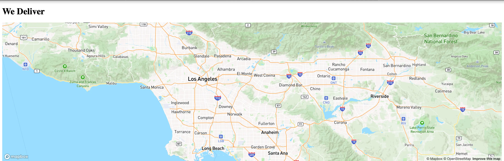
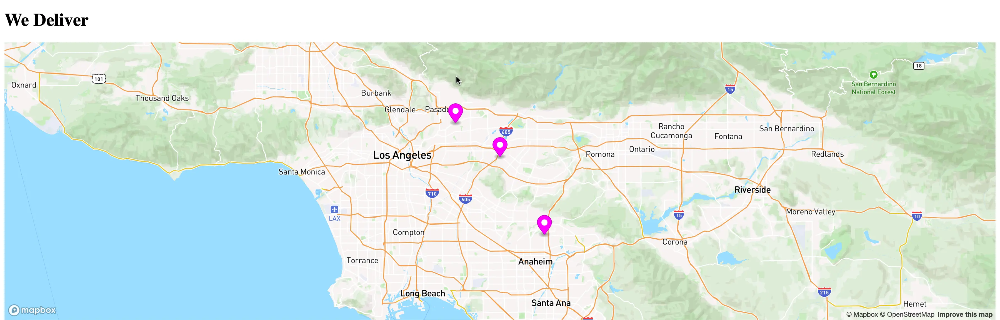

# Uber App using Svelte, Vite, Firebase, and Mapbox

## Lesson Objectives

1. Create a web application using Svelte and Vite.
2. Set up a firebase project for a delivery service.
3. Set up a firestore database to store our drivers locations.
4. Use Mapbox-gl on our web application to display a map with the location of our drivers.

# Svelte + Vite setup

In this tutorial we will be building a website using Node.js, Svelte, and Vite.

> Note: Svelte is a beginner-friendly JavaScript web framework, offering powerful features to simplify web development. Learn more about Svelte at: https://svelte.dev.

> Note:Vite is a fast build tool for setting up our development environment and bundling our application. Learn more about Vite at: https://vitejs.dev

## Initialize The Project Using Vite

Run this command in your console. Follow the instructions in the console to set up your Svelte project.

```bash
npm create vite@latest
```

> Note: We can clear app.css, App.svelte. and delete /lib/Counter.svelte in our project.

# Firebase

We'll be using Firebase, which provides several products to quickly get started with our project. In this phase we will only be using Firebase hosting to host our application on the web, and Firestore to quickly create a Nosql database, and will also allow us to sync data across all clients down the line.

## Get Started With Firebase

Visit the [Firebase website](https://firebase.google.com) and click Get Started to start setting up the project

### 1. Click "Add project" And Follow The Steps



> Note: Firebase will ask you if you would like to set up Analytics. It's optional, but it can be useful for monitoring your website and we will have it set up for this project.

## Create a Firestore NoSql database.

After creating a Firebase project, you'll be directed to the Firebase console. In the sidebar, navigate to the "Build" submenu, where you'll find Firebase's array of products. Choose "Firestore Database" from the options and proceed to create your Firestore database.

1. When setting up Firestore, you'll be prompted to choose a location for your database. It's crucial to select a location closest to your clients to minimize latency. For our purposes, we'll opt for Los Angeles. Once selected, the database location cannot be changed later, so choose carefully

2. You'll then be asked to configure the security rules for the database. For convinience, we'll opt for test mode, allowing us to read and write data without authentication. However, it's important to note the security implications of this approach, which may not be suitable for production environments.



Now that our database is created, let's start by adding our first collection. We'll name it "locations". Then, for each of our drivers, we'll create a document and assign them a geolocation using the appropriate data type.

The resulting database structure will resemble the following:



## Add Firebase To A Web Application

Now that our database is set up and populated with data, let's move on to Adding Firebase to our web application.

In the Firebase console, navigate to your project.
Select the option to register a new web app.
Note that there are options for Android and iOS apps as well. If we decide to expand this project to these platforms in the future, we can add them to this project.
Registering our web application will provide us with the necessary configuration details to integrate Firebase into our frontend application.



### 1. Register Your Application

> Ensure that "Set up Firebase Hosting" is enabled. This step is crucial as Firebase Hosting provides fast and secure hosting for your web application, allowing you to deploy and serve your static and dynamic content with ease. Enabling Firebase Hosting will also ensure that your web application is accessible to users on the web.



### 2. Add Firebase SDK

Go to node project that we created earlier and open a new terminal in our projects directory.

```bash
  npm install firebase
```

#### Initialize firebase in App.svelte, and import our SDKs.

> At this point, App.svelte should look like this:

```javascript
// Script tags is where our javascript goes
<script>
// Import the functions you need from the SDKs you need
import { initializeApp } from "firebase/app";
import { getAnalytics } from "firebase/analytics";
// TODO: Add SDKs for Firebase products that you want to use
// https://firebase.google.com/docs/web/setup#available-libraries

// TODO: Replace the following with your app's Firebase project configuration
// See: https://support.google.com/firebase/answer/7015592
const firebaseConfig = {
  YOUR_FIREBASE_CONFIGURATION
};

// Initialize Firebase
const app = initializeApp(firebaseConfig);
const analytics = getAnalytics(app);
</script>

// Html
<main>
  <h1>We Deliver</h1>
</main>

// Style tags for our css.
<style>

</style>
```

### 3. Install Firebase Command Line Interface (required for hosting)

```bash
  npm install firebase-tools
```

> Note: This step is necessary to set up hosting. The Firebase Command Line Interface (CLI) is a powerful tool provided by Google Firebase to interact with Firebase services from the command line.

#### Google Login

```bash
firebase login
```

> Note: Logging in with your Google account using firebase login allows you to authenticate and access your Firebase projects from the command line.

#### Initiate Your Project

```bash
  firebase init
```

> Note: Running firebase init will add hosting and Firestore to our project. You'll notice that Firebase will add files as it progresses. Since we're using Vite, and its build tool includes static files in the 'dist' directory, make sure to configure the public file to be 'dist' (can also be configured in /firebase.json). You can follow along with the console output below for guidance.

```bash
     ######## #### ########  ######## ########     ###     ######  ########
     ##        ##  ##     ## ##       ##     ##  ##   ##  ##       ##
     ######    ##  ########  ######   ########  #########  ######  ######
     ##        ##  ##    ##  ##       ##     ## ##     ##       ## ##
     ##       #### ##     ## ######## ########  ##     ##  ######  ########

You're about to initialize a Firebase project in this directory:

  /Users/juansierra/wedeliver

? Which Firebase features do you want to set up for this directory? Press Space to select features, then Enter to confirm your choices. Firestore: Configure
security rules and indexes files for Firestore, Hosting: Configure files for Firebase Hosting and (optionally) set up GitHub Action deploys

=== Project Setup

First, let's associate this project directory with a Firebase project.
You can create multiple project aliases by running firebase use --add,
but for now we'll just set up a default project.

? Please select an option: Use an existing project
? Select a default Firebase project for this directory: wedeliver-18a9a (wedeliver)
i  Using project wedeliver-18a9a (wedeliver)

=== Firestore Setup

Firestore Security Rules allow you to define how and when to allow
requests. You can keep these rules in your project directory
and publish them with firebase deploy.

? What file should be used for Firestore Rules? firestore.rules

Firestore indexes allow you to perform complex queries while
maintaining performance that scales with the size of the result
set. You can keep index definitions in your project directory
and publish them with firebase deploy.

? What file should be used for Firestore indexes? firestore.indexes.json

=== Hosting Setup

Your public directory is the folder (relative to your project directory) that
will contain Hosting assets to be uploaded with firebase deploy. If you
have a build process for your assets, use your build's output directory.

? What do you want to use as your public directory? dist
? Configure as a single-page app (rewrite all urls to /index.html)? No
? Set up automatic builds and deploys with GitHub? No (optional)
✔  Wrote dist/404.html
✔  Wrote dist/index.html

i  Writing configuration info to firebase.json...
i  Writing project information to .firebaserc...

✔  Firebase initialization complete!
```

### 4. Deploy Firebase Hosting

Run the following command.

```bash
firebase deploy
```

After successful deployment, you should receive a confirmation message like this:

```
✔  Deploy complete!

Project Console: https://console.firebase.google.com/project/example/overview
Hosting URL: https://example.web.app
```

You can paste the Hosting URL in your browser to confirm that your website is live.



> Note: When you're ready to deploy changes to your website, you'll utilize firebase deploy again. However, for the time being, let's continue using our development environment until we're ready.

If you haven't initiated the Vite server previously, you can start it by executing the following command in your project directory:

```
$ npm run dev
```

# MapBox

We will be using mapbox-gl js to display the map on our webpage.
Get your access token from: https://account.mapbox.com

## Install Mapbox npm Package:

```bash
npm install --save mapbox-gl
```

Import the following dependencies in App.Svelte, and import the stylesheet required to display it. This CSS file is necessary for rendering the map and enabling features such as Popups and Markers.

```js
import { onMount } from "svelte";
import mapboxgl from "mapbox-gl";
import "mapbox-gl/dist/mapbox-gl.css";
```

Append this function within the script tags in 'App.svelte':

```js
const initializeMap = async () => {
  // TO MAKE THE MAP APPEAR YOU MUST
  // ADD YOUR ACCESS TOKEN FROM
  // https://account.mapbox.com
  mapboxgl.accessToken = "YOUR_ACCESS_TOKEN";
  const map = new mapboxgl.Map({
    container: "map", // container ID
    style: "mapbox://styles/mapbox/streets-v12", // style URL
    center: [-118, 34], // starting position [lng, lat]
    zoom: 11, // starting zoom
  });
};

onMount(() => {
  initializeMap();
});
```

> Note: We need to make sure component is mounted before running this javascript code. Reason ? because we need to make sure div element with id = 'map' exists when creating the map.

After the script tag in App.svelte, we can include the following to display and style our map:

```html
<main>
  <div id="map"></div>
</main>

<style>
  #map {
    height: 500px; /* Adjust the height as needed */
    width: 100%; /* Adjust the width as needed */
  }
</style>
```

### Result



## Read From The Database To Create Markers On Our Map

Import the Firestore sdk in App.svelte, we will use this to read from the Firestore database we created earlier

```js
import { getFirestore } from "firebase/firestore";
import { collection, getDocs } from "firebase/firestore";
```

Then append the following javascript in our InitiateMap() function. This code will get the location data from our database, and use the data to create markers on our map:

```js
// We specify the locations collection that we created earlier.
const querySnapshot = await getDocs(collection(db, "locations"));
// Create a marker for each driver in our database.
querySnapshot.forEach((doc) => {
  // doc.data() is never undefined for query doc snapshots
  let data = doc.data();
  console.log(doc.id, " => ", doc.data());

  // Get the longitute and latitude values from our data object to create markers on our map
  new mapboxgl.Marker({
    color: "#FF00FF",
    draggable: false,
  })
    .setLngLat([data.location.longitude, data.location.latitude]) // Use the coordinates of our drivers.
    .addTo(map);
});
```

# Result



## What We Learned

### Svelte + Vite Setup

- Created a web application using Svelte and Vite, taking advantage of their simplicity and speed in development.
- Utilized Svelte, a beginner-friendly JavaScript web framework, and Vite, a fast build tool, to streamline web development.

### Firebase Integration

- Set up a Firebase project, leveraging Firebase hosting and Firestore for our service.
- Learned to configure Firestore database, including location selection and security rule setup.
- Integrated Firebase into our web application, registering and initializing the Firebase SDKs.
- Used Firebase CLI to set up hosting and deploy our application to the web.

### Mapbox Integration

- Implemented Mapbox-gl JS to display a map on our webpage.
- Installed the Mapbox npm package and imported necessary dependencies.
- Utilized Mapbox access token and created a map instance with custom markers.
- Leveraged Firestore SDK to read data from the database and dynamically create markers on the map.
- Styled the map container using CSS to achieve the desired appearance.

Congratulations !! That sums up this tutorial.

# What's Next?

For now we will avoid deploying our website to production to avoid exposing our sensitive data.

We'll address the challenge of securing API keys in our client-side projects. We'll explore using environment variables and other secure practices to keep our sensitive information safe.

## Securing API Keys with Environment Variables

In the upcoming tutorial, we'll:

- **Use Environment Variables:** Learn how to utilize environment variables to safeguard our API keys outside of our codebase.
- **Integrate Securely:** Explore how to seamlessly integrate environment variables into our build process for enhanced security.

- **Server-side Handling:** Discover techniques like backend proxies and serverless functions to manage API keys securely on the server side.

Stay tuned for our next tutorial, where we'll enhance the security of our client-side projects by implementing these best practices for API key management.
